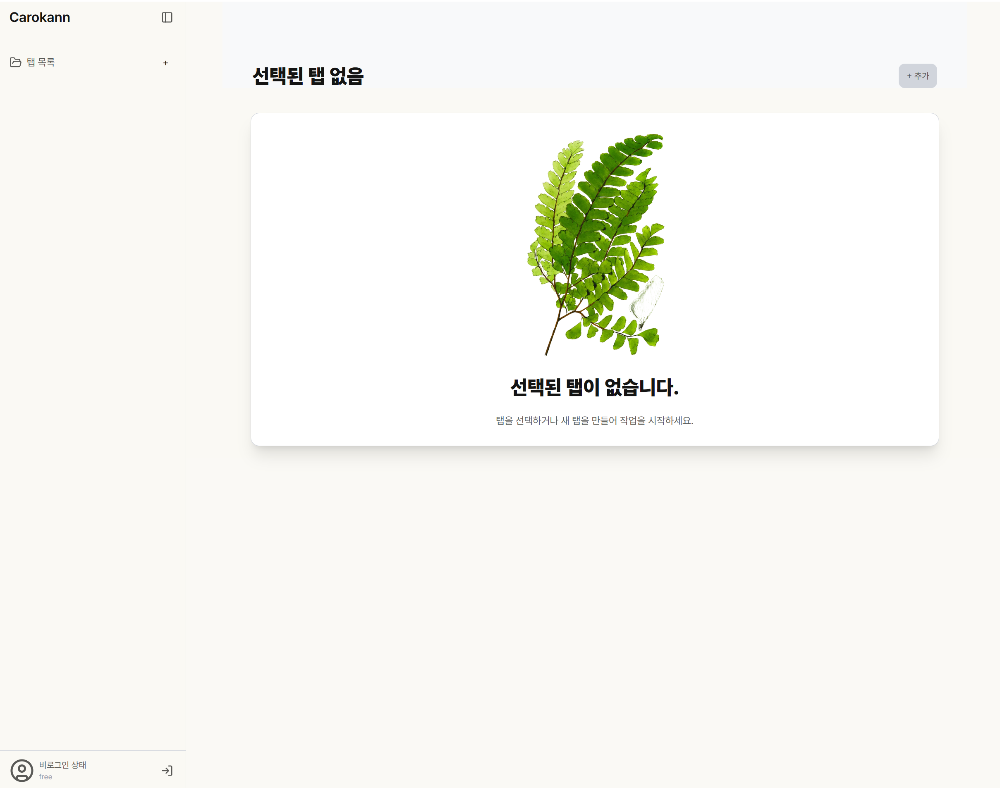
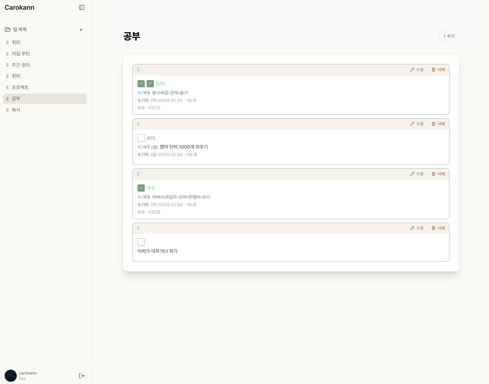

<h2 align="center">Carokann</h2>

<div align="center">
  <p>Carokann은 탭 단위로 루틴과 반복 작업을 정리하고, 주기와 시간 기준에 따라 작업을 자동으로 다시 시작할 수 있게 만든 개인용 작업 리셋 트래커입니다.</p>

  <p>비회원으로도 사용 가능하며, 최초 로그인 시 데이터가 이관됩니다.</p>
<div>

<p align="center">
  
  
</p>

## 배포 링크 / GitHub

- 배포 링크: https://carokann.app
- GitHub: https://github.com/carokann1945/carokann

## 주요 기능

### 탭 기반 작업 분류

작업을 탭으로 나눠 관리할 수 있습니다. 운동, 공부, 생활, 게임 루틴처럼 성격이 다른 작업을 각각의 탭에 모아두고 전환하며 확인할 수 있습니다. 탭은 추가, 이름 변경, 삭제, 순서 변경이 모두 가능합니다.

### 일반 작업 / 반복 작업

두 가지 작업 유형을 제공합니다.

- **일반 작업**: 한 번 체크하고 끝내는 단순 작업입니다.
- **반복 작업**: 주기마다 자동으로 초기화되는 작업입니다. 매일 할 운동 루틴, 매주 챙겨야 하는 퀘스트처럼 반복되는 항목에 사용합니다.

### 반복 주기 설정

반복 작업에 원하는 초기화 주기를 지정할 수 있습니다.

- **프리셋**: 매일, 매주, 매월, 매년
- **커스텀**: N일마다 (직접 숫자 입력)

주기는 작업 생성 시 또는 이후 언제든지 변경할 수 있습니다.

### 다중 체크 목표

반복 작업 하나에 한 사이클 동안 달성해야 할 체크 횟수를 설정할 수 있습니다. 예를 들어 주간 운동 목표를 "5회"로 설정하면, 한 주 안에 5번 체크해야 해당 작업이 완료됩니다. 목표 횟수는 1~10 사이에서 지정할 수 있습니다.

### 자동 리셋

반복 작업은 새로운 사이클로 진입하는 시점에 체크 상태와 완료 기록이 자동으로 초기화됩니다. 앱을 열 때마다 현재 사이클을 계산해 이전 사이클의 체크 상태를 자동으로 비웁니다.

### 다음 리셋 카운트다운

각 반복 작업에서 다음 초기화까지 남은 시간을 확인할 수 있습니다. 요일, 날짜, 시각 형태로 표시되어 언제 다시 시작해야 하는지 한눈에 파악할 수 있습니다.

### 타임존 설정

반복 작업의 초기화 시점을 계산할 때 기준이 되는 시간대를 설정할 수 있습니다.

- **plain**: 시간대 없이 순수 날짜 기준으로 계산합니다.
- **브라우저 타임존**: 현재 기기의 시간대를 기준으로 초기화 시점을 계산합니다.

### 드래그 앤 드롭 정렬

탭과 작업 모두 드래그 앤 드롭으로 순서를 바꿀 수 있습니다. 자주 확인하는 탭이나 작업을 위로 올려두거나, 원하는 순서로 자유롭게 정렬할 수 있습니다.

### 삭제 후 복구

작업이나 탭을 삭제하면 짧은 시간 동안 실행 취소(복구) 옵션이 표시됩니다. 실수로 삭제했을 때 빠르게 되돌릴 수 있으며, 복구 시 기존 순서도 함께 복원됩니다.

### Google 로그인 & 서버 저장

Google 계정으로 로그인하면 트래커 상태가 서버에 저장됩니다. 다른 기기나 브라우저에서 로그인해도 동일한 탭과 작업 목록을 불러올 수 있습니다. 변경 사항은 주기적으로 자동 저장되며, 페이지를 닫기 전에도 저장됩니다.

### 로컬 모드

로그인 없이도 사용할 수 있습니다. 비로그인 상태에서는 모든 데이터가 브라우저 로컬 스토리지에 저장됩니다. 로그인하지 않아도 앱의 모든 기능을 동일하게 이용할 수 있습니다.

### 반응형 레이아웃

- **데스크톱**: 사이드바가 왼쪽에 고정된 레이아웃으로 표시됩니다.
- **모바일**: 사이드바가 접혀 있다가 버튼을 누르면 화면 위에 오버레이로 열립니다.

## 기술 스택

- 프레임워크: Next.js 16, React 19
- 언어: TypeScript
- 스타일링: Tailwind CSS 4
- UI 프리미티브: Radix UI, shadcn/ui
- 상태 관리: Zustand
- 드래그 앤 드롭: dnd-kit
- 날짜 / 시간 처리: `@js-temporal/polyfill`
- 인증: Supabase Auth
- DB / ORM: Prisma, PostgreSQL
- 알림 UI: Sonner
- 테스트: Vitest

## 아키텍처 / 폴더 구조

```text
src
├─ actions
│  ├─ auth.actions.ts
│  ├─ profile.actions.ts
│  └─ tracker.actions.ts
├─ app
│  ├─ (auth)
│  ├─ (tracker)
│  ├─ globals.css
│  └─ layout.tsx
├─ features
│  └─ tracker
│     ├─ components
│     │  ├─ sidebar
│     │  └─ task
│     ├─ hooks
│     └─ model
└─ lib
```

- `app/(tracker)` — 트래커 화면 진입점. `TrackerPersistenceProvider`로 부트스트랩과 저장 흐름을 관리합니다.
- `app/(auth)` — 로그인 화면과 OAuth 콜백 경로를 담당합니다.
- `actions` — 인증/DB와 직접 맞닿는 서버 액션 레이어입니다.
- `features/tracker/components` — `Header`, `Sidebar`, `TaskList`, `TaskItem`, `TaskDialog` 등 UI 컴포넌트를 모아두었습니다.
- `features/tracker/model` — 타입, Zustand 스토어, 로컬 스토리지 입출력, 반복 작업 계산, persistence provider를 포함한 도메인 레이어입니다.

## 실행 방법

```bash
pnpm install
pnpm dev
pnpm build
pnpm vitest run
```

- 개발 서버: `pnpm dev`
- 프로덕션 빌드 확인: `pnpm build`
- 테스트 실행: `pnpm vitest run`
